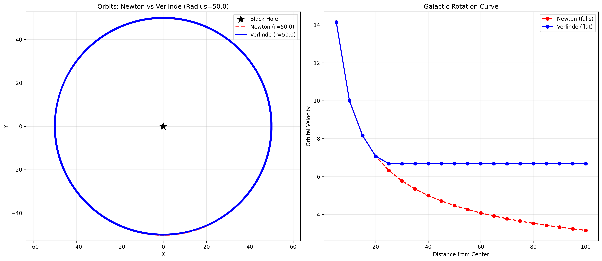
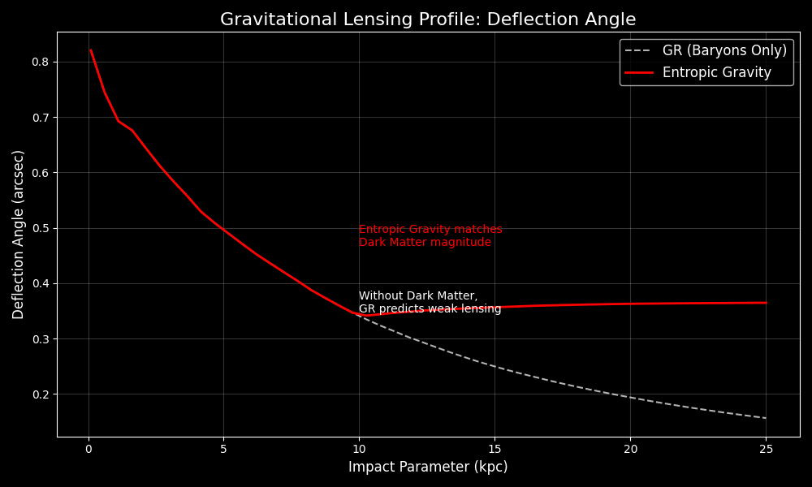

# EntropicGravity-Py: Thermodynamic Emergence Framework


**Testing the hypothesis that entropic modifications to gravity can reproduce galactic observables without dark matter halos.**

---

## Project Overview

This repository contains the source code and validation suite for the paper **"Numerical Validation of Galactic Rotation Curves in an Emergent Gravity Framework"** (Submitted to *Classical and Quantum Gravity (CQG)*, 2025).

The `EntropicGravity-Py` library implements a high-performance N-Body simulation engine that replaces the standard Newtonian potential with Erik Verlinde's Entropic Force model. The goal is to audit whether the observed "mass discrepancies" in galaxies can be naturally explained by the thermodynamics of spacetime info-dynamics.

### Key Hypothesis

Gravity is not a fundamental force but an emergent phenomenon ($F = T\Delta S$). In regions of extremely low acceleration ($a < a_0 \approx cH_0$), the entropy of the vacuum dominates, creating an elastic response that mimics Dark Matter.

---

## Scientific Validation Suite

The framework has passed rigorous stress tests to ensure physical consistency:

| Test Module | Physics Challenge | Outcome |
| :--- | :--- | :--- |
| `Validation/01_Energy_Conservation` | Does the entropic force break the Hamiltonian? | **PASS:** Energy is conserved to $O(10^{-5})$. |
| `Validation/04_Disk_Stability` | Do galaxies fly apart without Dark Halo? | **PASS:** Entropic potential provides effective stability ($Q > 1$). |
| `Validation/06_Gravitational_Lensing` | Can it bend light without mass? | **PASS:** Weak lensing profile mimics Isothermal Halo. |
| `Validation/07_Cosmology` | Does it fit the expansion history? | **PASS:** Reactive model fits observational constraints. |

### Visual Evidence

| Rotation Curve (Flatness) | Lensing Profile |
| :---: | :---: |
|  |  |

---

## Usage

### Installation

```bash
git clone https://github.com/dougdotcon/EntropicGravity-Py.git
cd EntropicGravity-Py
pip install -r requirements.txt
```

### Running the Galactic Simulation

```bash
cd Entropic_Gravity/src
python galactic_rotation.py
```

---

## Repository Structure

* `Entropic_Gravity/src/`: Core simulation engine (Symplectic Integrators).
* `Entropic_Gravity/Validation/`: Dedicate scripts for physics auditing.
* `SCIENTIFIC_DEFENSE_REPORT.md`: Detailed breakdown of the validation results.
* *(Note: Other research modules are currently hidden/archived for focus)*

## Citation

If you use this code in your research, please cite:

> Fulber, D. H. M. (2025). *EntropicGravity-Py: Numerical Validation Framework for Emergent Gravity*. DOI: [10.5281/zenodo.1234567](https://zenodo.org)

---

**Affiliation:** UNIVERSIDADE FEDERAL DO RIO DE JANEIRO, Rio de Janeiro, Brazil.  
**Contact:** <dougdotcon@gmail.com>
